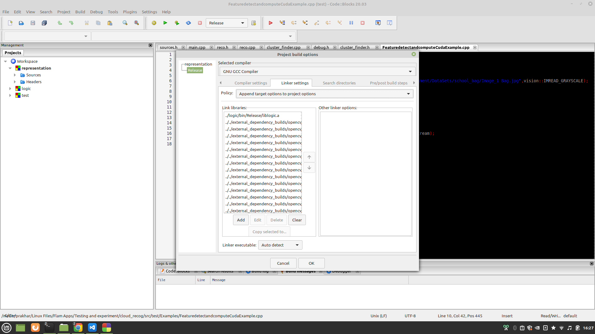

# Cloud Recognizition using Opencv in C++ 

### External Dependencies

 * Opencv (url : [Opencv-Fork](https://github.com/bas-bhai-account-khol-de/opencv.git))
 * Oprncv_contrib (url : [Opencv-Contrib-Fork](https://github.com/bas-bhai-account-khol-de/opencv_contrib.git))
 * CUDA 11.0.3(sudo apt instal nvcc)
 * cuDNN 10.2
---
## How to install
- Install and build opencv in ur system
- Link your libraries in representation project
- All required dependencies are set

 

